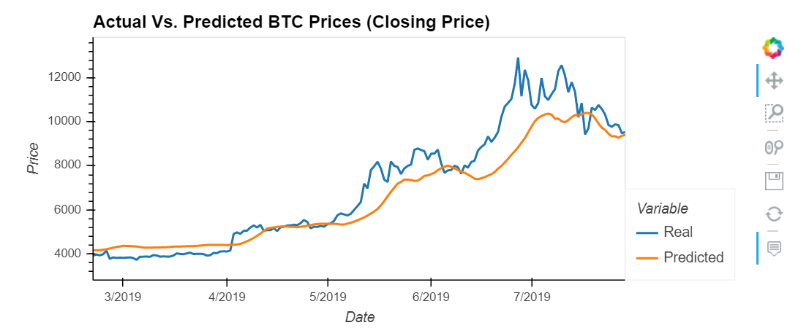

# Deep Learning Models

This project builded and evaluated deep learning models for Bitcoin using Crypto Fear and Greed Index (FNG) values and simple closing prices to determine if the FNG indicator provides a better signal for cryptocurrencies than the normal closing price data. To compared the closing prices and the FNG inficator I used LSTM model. One model used the FNG indicators to predict the closing price while the second model used a window of closing prices to predict the nth closing price.

## LSTM Stock Predictor Using Closing Prices
This model generates a loss of 0.0113 using a window size of 10. In general, the predicted price followed the trends of the real price, providing a signal to enter or exit the crypto. See image.

## LSTM Stock Predictor Using Fear and Greed Index
This model generates a loss of 0.0686 using a window size of 10. The FNG indicator did not provide any signal at all, the predicted price did not show any relation with real price. See image.

## Evaluate the performance of each model

* Which model has a lower loss?
* LSTM Stock Predictor Using Closing Prices has the lower loss of 0.0113

* Which model tracks the actual values better over time?
* LSTM Stock Predictor Using Closing Prices tracks the actual price better over time.

* Which window size works best for the model?
* A window size of 10 works best for the model.